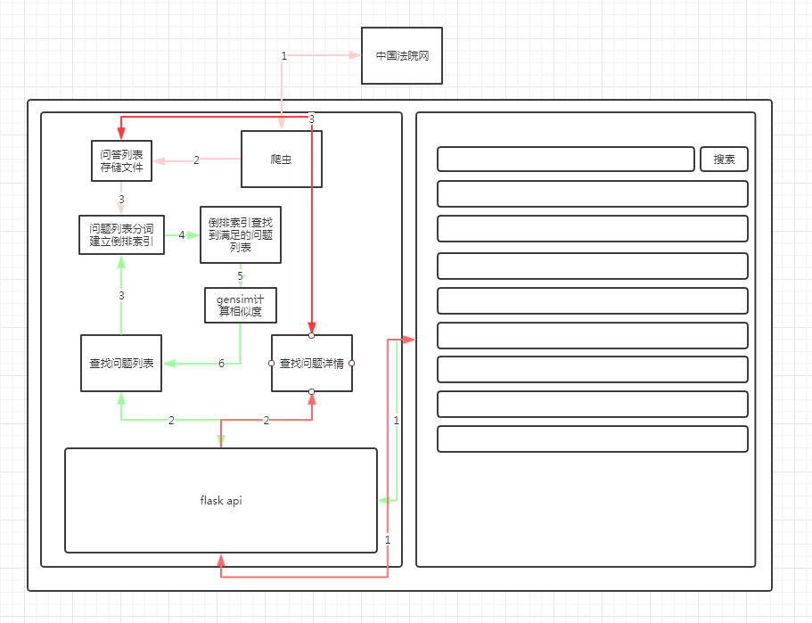

# chinacourt
- [什么是倒排索引？](https://blog.csdn.net/zsd_31/article/details/79979818)
- [一个倒排索引(inverted index)的python实现](https://blog.csdn.net/u011604052/article/details/50620780)
- [分词学习之——jieba](https://blog.csdn.net/weixin_42343616/article/details/81565750)
- [python文本相似度计算](https://www.jianshu.com/p/edf666d3995f)
- [使用jieba和gensim模块判断文本相似度](https://www.jianshu.com/p/cb978743f4d4)
- [使用 CSS3 实现超炫的 Loading（加载）动画效果](https://www.cnblogs.com/lhb25/p/loading-spinners-animated-with-css3.html)
- [flavr—超级漂亮的jQuery扁平弹出对话框](http://www.jq22.com/jquery-info2933)
- [Welcome | Flask (A Python Microframework)](http://flask.pocoo.org/)

### 系统整体结构

### 主要技术
- Flask框架
- 倒排索引
- 分词
- gensim文本相似度结算
- 前端页面html,js,css
- python函数

### 整体逻辑
1. 使用爬虫爬取[中国法院网](https://www.chinacourt.org)问答页所有问题与问答详情并存储到文本文件
2. 对文本文件中的所有问题提取出来，使用[结巴分词](https://github.com/fxsjy/jieba)进行分词，并建立倒排索引，使用pickle保存为pkl文件
3. 用户前端页面搜索问题
4. 对问题进行分词，从倒排索引中查出所有满足条件的问题
5. 使用[gensim](https://pypi.org/project/gensim/)对用户输入的问题与查出的问题进行相似度计算
6. 对结果根据相似度进行从高到低排序并返回，前端展示